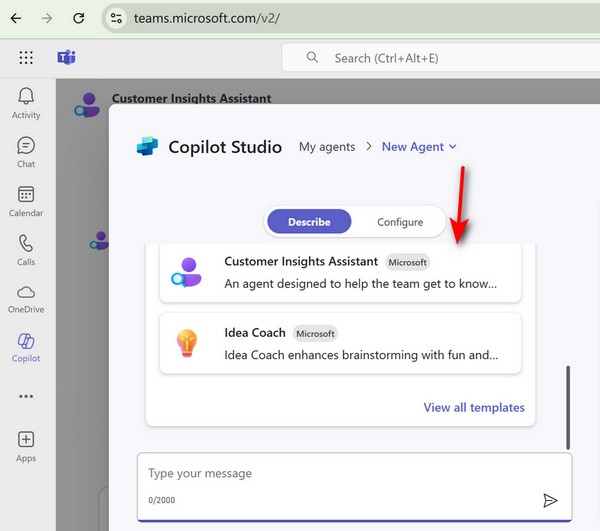
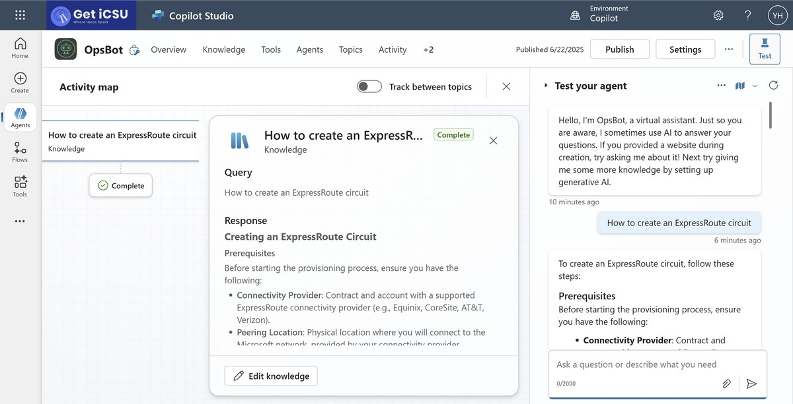
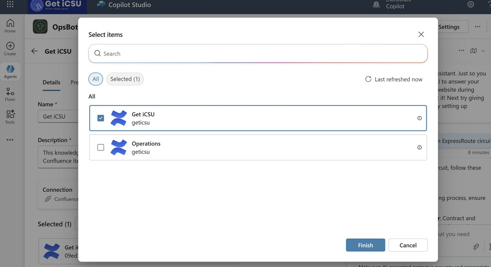
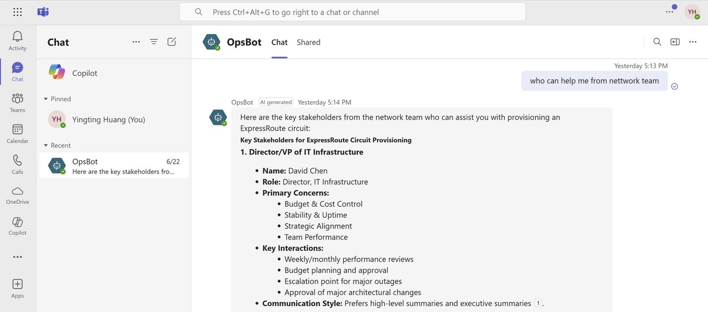
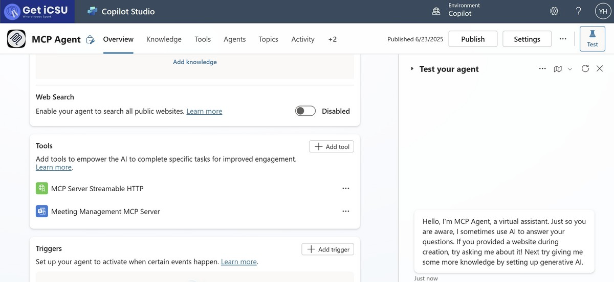
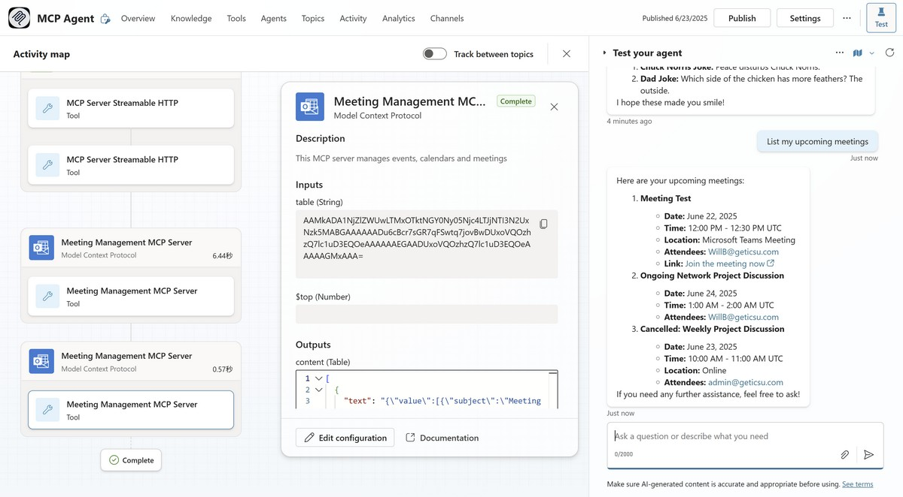
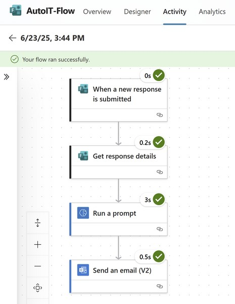
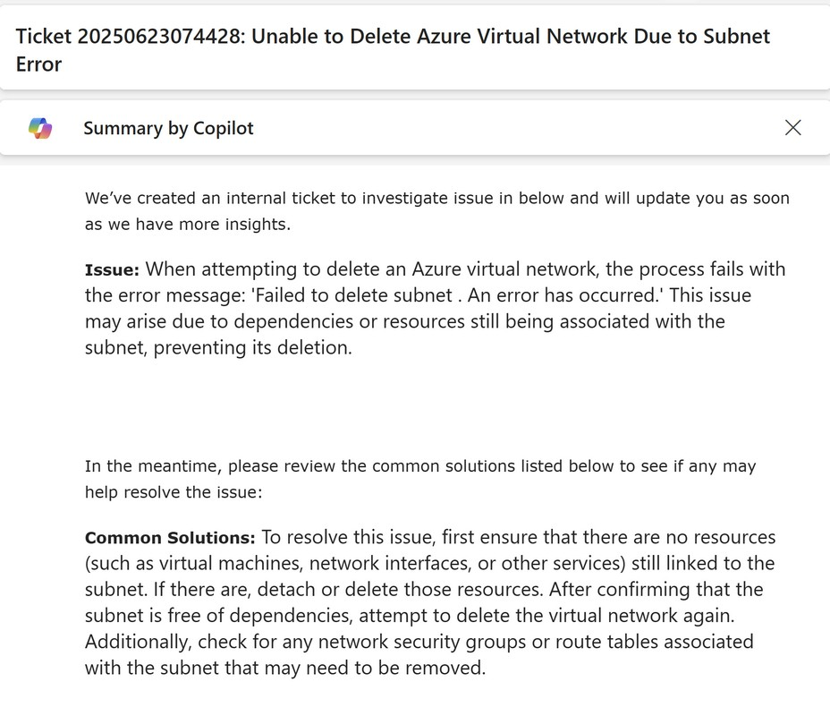
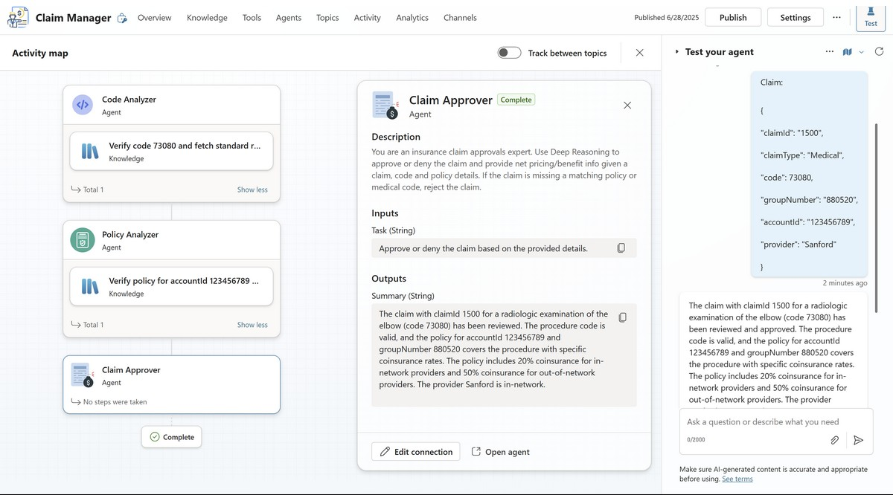

# Copilot Studio

Microsoft Copilot Studio is a platform for building and customizing AI-powered agents, also known as copilots, that can automate business processes and assist employees and customers.
This is a collection of demos showcasing the capabilities of Copilot Studio in various scenarios.

| Demo                                          | Description                                                                                   |
|------------------------------------------------|--------------------------------------------------------------------------------------------------------------|
| Declarative Agent - Customer Insights Assistant | Build custom AI assistants in M365 Copilot for customer insights, with enhanced prompts and truth-grounding. |
| Copilot Studio OpsBot                          | Use Confluence as a knowledge source for network operations Q&A.                                             |
| Copilot Studio MCP                             | Connect to MCP servers to book meetings and tell jokes.                                                      |
| Copilot Studio Agent Flows                     | Streamline ticket creation and automate responses with agent flows.                                          |
| Copilot Studio Multi-Agent                     | Create multiple agents to collaboratively solve complex problems (e.g., claim approval).                     |


## Declarative Agent - Customer Insights Assistant
### What is Declarative Agent?
Declarative agents for Microsoft 365 Copilot are custom AI assistants you can build by simply defining their behavior, instructions, and knowledge—no coding required.

### Demo - Customer Insights Assistant

#### Create a Declarative Customer Insights Assistant Agent
Create a declarative agent in M365 copilot

Try prompts like:
```
Provide insights on [Customer Name] based on the latest data.

Analyze [Customer Name] investment globally and draw a chart.
```

The original prompt lacks adequate truth-grounding, for example, if asking "What key insights can be drawn from [Customer Name]'s Q2 2025 results?", it may not provide the halucination answer.

[Original Prompt](./copilot-studio/CustomerInsightsAssistant.md)

The enhanced prompt incorporates several key improvements:
- ReAct Framework Integration
- Truth-Grounding Mechanisms
- Enhanced Structure
- Professional Methodology
- Strategic Focus

[Enhanced Prompt](./copilot-studio/CustomerInsightsAssistantEnhanced.md)


## Copilot Studio OpsBot
Demo how to use confluence as a knowledge source for network operations Q&A




## Copilot Studio MCP
Demo how to connect to MCP servers to book meeting and tell a joke




## Copilot Studio Agent Flows
Showcase how agent flows can streamline ticket creation and automate responses with commonly used solutions.

Steps:
- Submit an issue to https://forms.office.com/r/UJ2JG9r05i
- Agent flow will kick in to create a ticket and provide common solutions



## Copilot Studio Multi-Agent
Copilot Studio Multi-Agent allows you to create multiple agents that can work together to solve complex problems. Here is a demo for approving a claim request.
