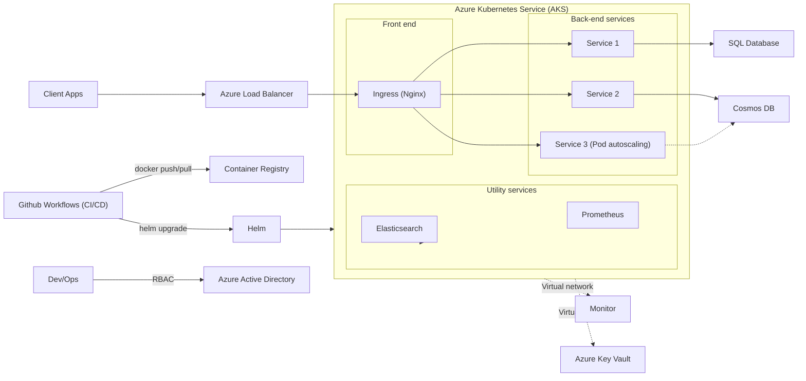

# Azure Infrastructure Deployment Guide

This repository now includes complete Azure Terraform deployment scripts and GitHub workflows to automate resource provisioning for the CopilotX architecture.

## 🏗️ Architecture Overview

The infrastructure implements the architecture shown in the mermaid diagram:



## 📁 Repository Structure

```
├── terraform/                 # Infrastructure as Code
│   ├── main.tf               # Core Azure resources
│   ├── variables.tf          # Input variables
│   ├── outputs.tf            # Output values
│   ├── providers.tf          # Provider configurations
│   ├── backend.tf            # Remote state configuration
│   ├── terraform.tfvars.example  # Example variables
│   └── README.md             # Terraform documentation
├── .github/workflows/        # CI/CD automation
│   ├── terraform-deploy.yml  # Infrastructure deployment
│   ├── container-build.yml   # Container image builds
│   └── app-deploy.yml        # Application deployment
└── DEPLOYMENT.md             # This guide
```

## 🚀 Quick Start

### 1. Prerequisites
- Azure subscription with Contributor access
- GitHub repository with Actions enabled
- Service Principal for authentication

### 2. Set Up GitHub Secrets
Configure these secrets in your repository settings:

```bash
# Azure Authentication
AZURE_CLIENT_ID=your-service-principal-id
AZURE_CLIENT_SECRET=your-service-principal-secret
AZURE_SUBSCRIPTION_ID=your-subscription-id
AZURE_TENANT_ID=your-tenant-id

# Terraform State Storage
TF_STATE_RESOURCE_GROUP=rg-terraform-state
TF_STATE_STORAGE_ACCOUNT=your-storage-account
TF_STATE_CONTAINER_NAME=tfstate

# Application Configuration
SQL_ADMIN_PASSWORD=secure-password
GRAFANA_ADMIN_PASSWORD=secure-password
```

### 3. Deploy Infrastructure
1. Push changes to the `main` branch
2. The `terraform-deploy.yml` workflow will automatically run
3. Review and approve the deployment in GitHub Actions

### 4. Build and Deploy Applications
1. Add your application code to `src/` directories
2. The `container-build.yml` workflow builds Docker images
3. The `app-deploy.yml` workflow deploys to AKS with Helm

## 🏗️ Infrastructure Components

### Core Services
- **AKS Cluster** with auto-scaling node pools
- **Azure Container Registry** for image storage
- **Application Gateway** for load balancing
- **Virtual Network** with subnet isolation

### Data Layer
- **Azure SQL Database** for Service 1
- **Cosmos DB** for Services 2 & 3
- **Key Vault** for secrets management

### Monitoring Stack
- **Azure Monitor** and **Log Analytics**
- **Application Insights** for APM
- **Prometheus** for metrics collection
- **Grafana** for visualization
- **Elasticsearch** for log aggregation

### Security & Networking
- **Azure Active Directory** integration
- **RBAC** for access control
- **Network Security Groups**
- **Private endpoints** for secure connectivity

## 🔄 CI/CD Workflows

### 1. Infrastructure Pipeline (`terraform-deploy.yml`)
- **Trigger**: Changes to `terraform/` directory
- **Actions**: Plan → Review → Apply
- **Outputs**: AKS credentials, ACR details

### 2. Container Pipeline (`container-build.yml`)
- **Trigger**: Changes to `src/` directory
- **Actions**: Build → Test → Push to ACR
- **Security**: Vulnerability scanning with Trivy

### 3. Application Pipeline (`app-deploy.yml`)
- **Trigger**: Successful container build
- **Actions**: Deploy Helm charts → Configure ingress
- **Features**: Blue/green deployments, health checks

## 🎯 Service Architecture

### Frontend Layer
- **NGINX Ingress Controller** handles HTTP routing
- **SSL termination** and **rate limiting**
- **Custom domain** support with cert-manager

### Backend Services
- **Service 1**: Stateless API connecting to SQL Database
- **Service 2**: Event-driven service using Cosmos DB
- **Service 3**: Auto-scaling microservice with HPA

### Utility Services
- **Elasticsearch**: Centralized logging and search
- **Prometheus**: Metrics collection from all services
- **Grafana**: Monitoring dashboards and alerting

## 🔧 Configuration

### Environment Variables
Services receive configuration through:
- **ConfigMaps** for non-sensitive data
- **Secrets** from Azure Key Vault
- **Service discovery** via Kubernetes DNS

### Auto-scaling Configuration
- **Cluster Autoscaler**: 1-10 nodes based on demand
- **HPA**: Service 3 scales 1-10 pods on CPU/memory
- **VPA**: Optional vertical scaling for optimization

### Monitoring & Alerting
- **Custom metrics** from Prometheus
- **Application insights** for performance
- **Azure Monitor** alerts for infrastructure
- **Grafana dashboards** for visualization

## 🛡️ Security Best Practices

### Identity & Access
- **Service Principal** with minimal permissions
- **Managed Identity** for AKS components
- **RBAC** for fine-grained access control
- **Azure AD** integration for user authentication

### Network Security
- **Private AKS cluster** option available
- **Network policies** for pod-to-pod communication
- **Private endpoints** for Azure services
- **WAF rules** on Application Gateway

### Secrets Management
- **Azure Key Vault** for all secrets
- **CSI driver** for pod secret injection
- **Rotation policies** for credentials
- **Encryption at rest** and in transit

## 📊 Monitoring & Observability

### Metrics Collection
- **Prometheus** scrapes application metrics
- **Azure Monitor** collects infrastructure metrics
- **Custom dashboards** in Grafana
- **SLI/SLO** tracking for reliability

### Logging Strategy
- **Structured logging** with JSON format
- **Elasticsearch** for log aggregation
- **Kibana** for log analysis and visualization
- **Log retention** policies configured

### Alerting Rules
- **Infrastructure alerts** via Azure Monitor
- **Application alerts** via Prometheus
- **PagerDuty/Slack** integration for notifications
- **Runbook automation** for common issues

## 🔄 Disaster Recovery

### Backup Strategy
- **Database backups** with point-in-time recovery
- **Persistent volume** snapshots
- **Configuration as Code** for quick rebuilds
- **Multi-region** deployment option

### High Availability
- **Multi-zone** AKS deployment
- **Database geo-replication**
- **Load balancer** health checks
- **Auto-recovery** mechanisms

## 📈 Cost Optimization

### Resource Optimization
- **Reserved instances** for predictable workloads
- **Spot instances** for development environments
- **Auto-scaling** to match demand
- **Resource quotas** to prevent overspend

### Monitoring Costs
- **Azure Cost Management** integration
- **Budget alerts** for spending limits
- **Resource tagging** for cost allocation
- **Regular optimization** reviews

## 🚀 Next Steps

1. **Customize** the Terraform variables for your environment
2. **Add** your application code to the `src/` directories
3. **Configure** domain names and SSL certificates
4. **Set up** monitoring alerts and notifications
5. **Implement** backup and disaster recovery procedures

## 📖 Additional Resources

- [Terraform Documentation](./terraform/README.md)
- [Azure AKS Best Practices](https://docs.microsoft.com/en-us/azure/aks/)
- [Kubernetes Security Guide](https://kubernetes.io/docs/concepts/security/)
- [Prometheus Monitoring](https://prometheus.io/docs/)

## 🆘 Support

For questions or issues:
1. Check the [Terraform README](./terraform/README.md)
2. Review GitHub Actions logs
3. Consult Azure documentation
4. Open an issue in this repository