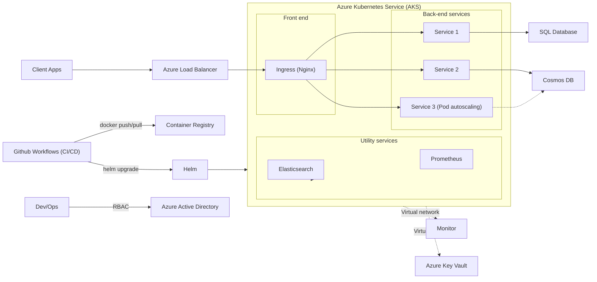

### Copilot Studio OpsBot
Demo how to use confluence as a knowledge source for network operations Q&A


### Copilot Studio MCP
Demo how to connect to MCP servers to book meeting and tell a joke


### Copilot Studio Agent Flows
Showcase how agent flows can streamline ticket creation and automate responses with commonly used solutions.


### Azure MCP
Start MCP server from mcp.json file.
```
Please generate a Mermaid diagram that provides an overview of all my currently deployed resources.
```

### Github Copilot Custom Chat Mode

#### Network Operations Planning
By leveraging the custom chat mode in Github Copilot, you can create a more interactive and tailored experience for network operations planning. Here’s how you can use it:

```
Please review my current Azure network resources and provide recommendations for a more optimized and cost-effective network architecture.
```


#### Azure Terraform Script Generation
You can use the custom chat mode to generate Terraform scripts for Azure resources. Here’s an example of how to do this:
```
Based on the azure-arch.png image, please generate terraform deployment script
```


### Github Copilot Coding Agent
Use Github Copilot to generate Azure Terraform scripts and GitHub workflows for automating resource provisioning based on the provided architecture diagram.

```
Based on below mermaid diagram, develop Azure Terraform deployment scripts and GitHub workflows to automate resource provisioning.
```


[Task: Develop Azure Terraform deployment scripts and GitHub workflows to automate resource provisioning](https://github.com/huangyingting/CopilotX/issues/1)

### Azure SRE Agent
Azure SRE Agent brings these principles to your Azure hosted applications by providing an AI-powered tool that helps sustain production cloud environments.
