## Declarative Agent - Customer Insights Assistant
### What is Declarative Agent?
Declarative agents for Microsoft 365 Copilot are custom AI assistants you can build by simply defining their behavior, instructions, and knowledge—no coding required.

### Demo - Customer Insights Assistant

#### Create a Declarative Customer Insights Assistant Agent
Create a declarative agent in M365 copilot
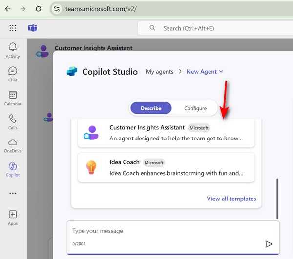
Try prompts like:
```
Provide insights on [Customer Name] based on the latest data.

Analyze [Customer Name] investment globally and draw a chart.
```

The original prompt lacks adequate truth-grounding, for example, if asking "What key insights can be drawn from [Customer Name]'s Q2 2025 results?", it may not provide the halucination answer.

[Original Prompt](./prompts/CustomerInsightsAssistant.md)

The enhanced prompt incorporates several key improvements:
- ReAct Framework Integration
- Truth-Grounding Mechanisms
- Enhanced Structure
- Professional Methodology
- Strategic Focus

[Enhanced Prompt](./prompts/CustomerInsightsAssistantEnhanced.md)


## Copilot Studio OpsBot
Demo how to use confluence as a knowledge source for network operations Q&A
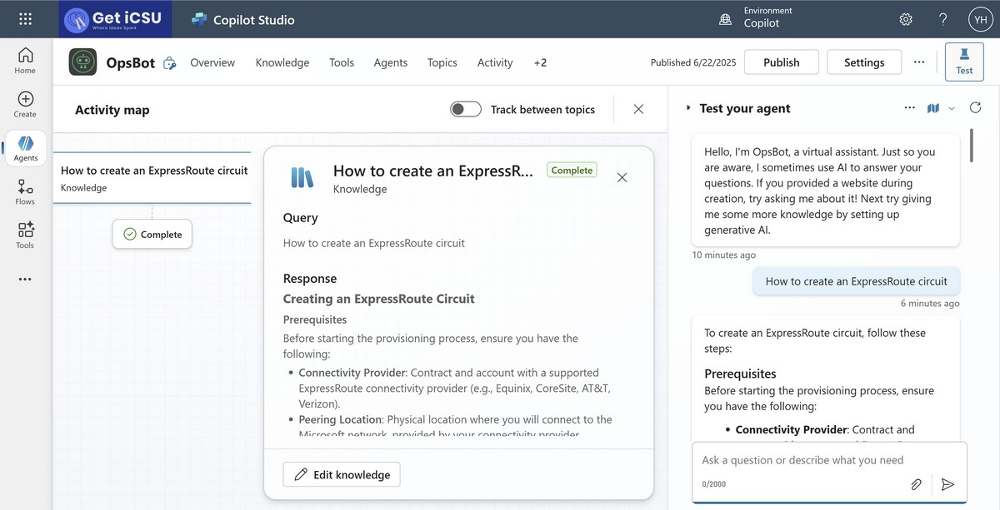
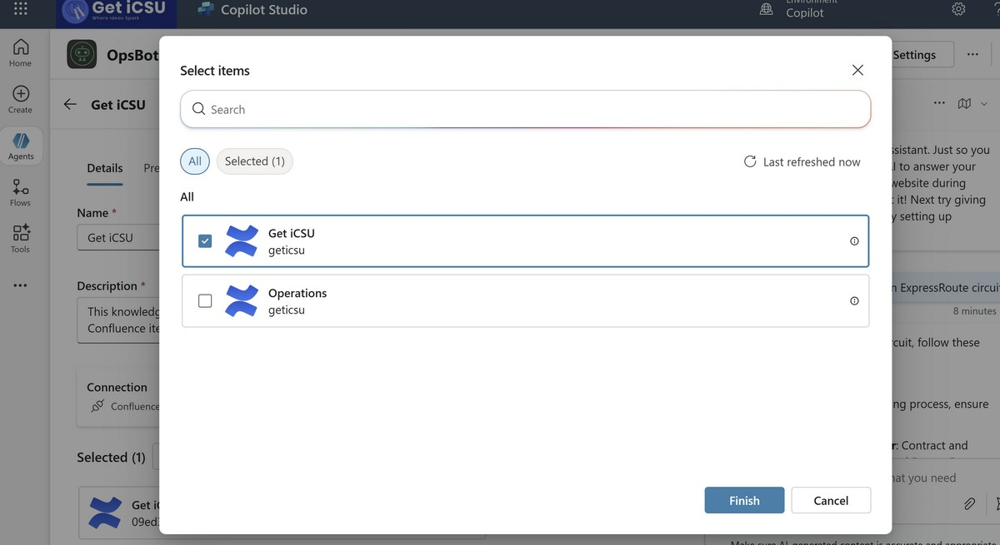
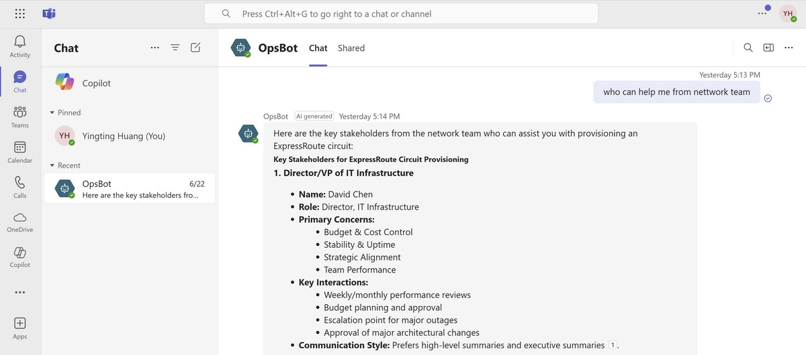

## Copilot Studio MCP
Demo how to connect to MCP servers to book meeting and tell a joke
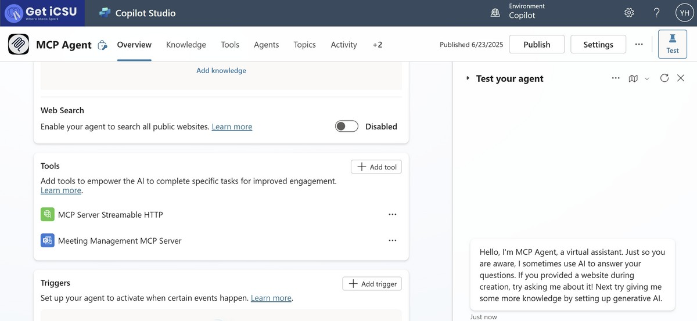
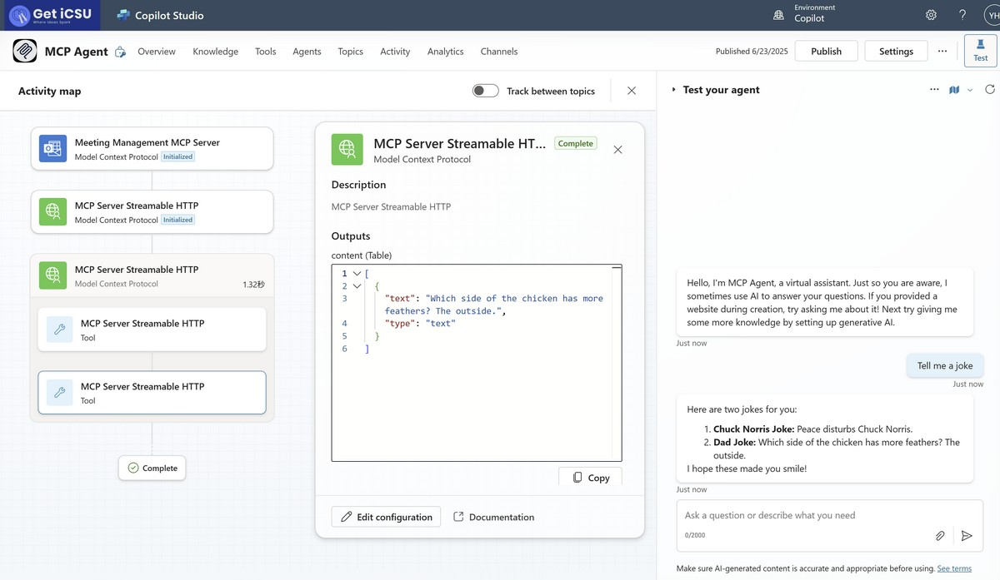
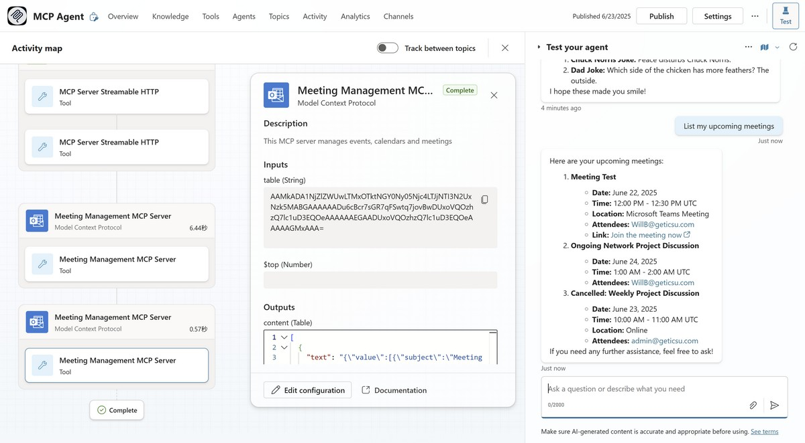

## Copilot Studio Agent Flows
Showcase how agent flows can streamline ticket creation and automate responses with commonly used solutions.

Steps:
- Submit an issue to https://forms.office.com/r/UJ2JG9r05i
- Agent flow will kick in to create a ticket and provide common solutions
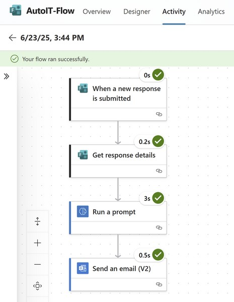
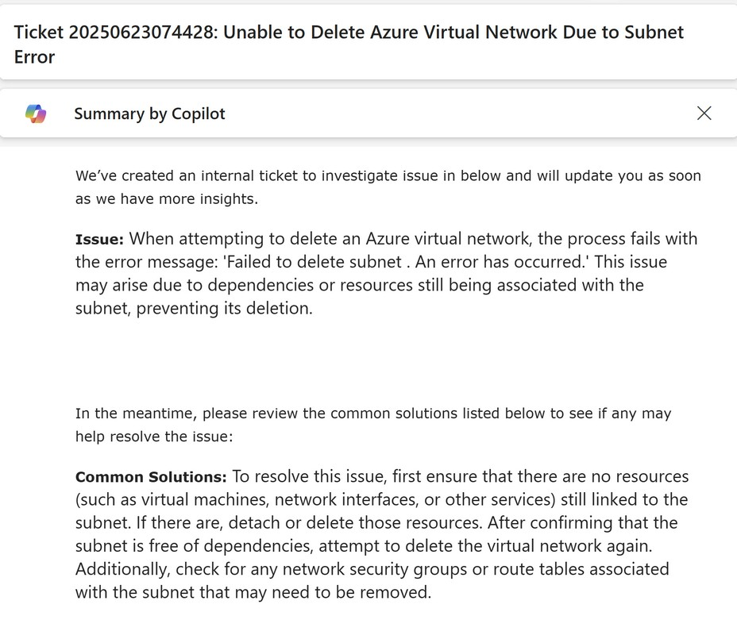

## Azure MCP
Start MCP server from mcp.json file.
```
Please generate a Mermaid diagram that provides an overview of all my currently deployed resources.
```

## Github Copilot Custom Chat Mode

### Network Operations Planning
By leveraging the custom chat mode in Github Copilot, you can create a more interactive and tailored experience for network operations planning. Here’s how you can use it:

```
Please review my current Azure network resources and provide recommendations for a more optimized and cost-effective network architecture.
```
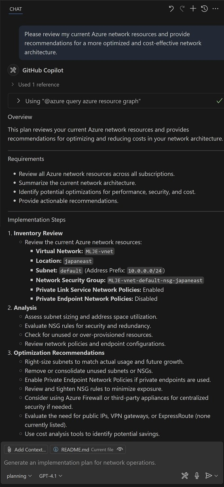

### Azure Terraform Script Generation
You can use the custom chat mode to generate Terraform scripts for Azure resources. Here’s an example of how to do this:
```
Based on the azure-arch.png image, please generate terraform deployment script
```
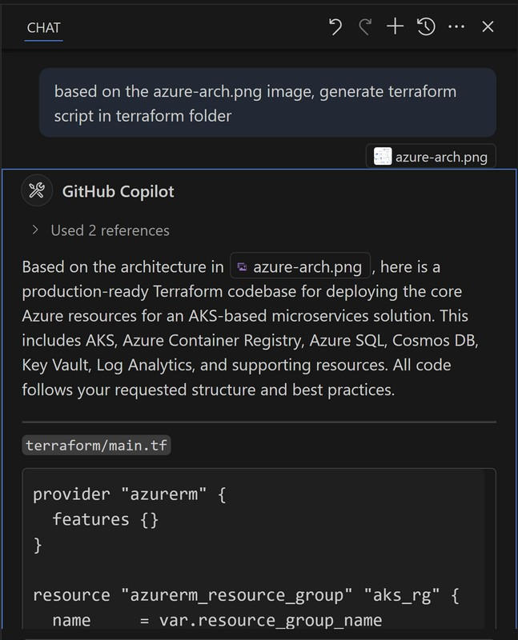

## Github Copilot Coding Agent
Use Github Copilot to generate Azure Terraform scripts and GitHub workflows for automating resource provisioning based on the provided architecture diagram.

```
Based on below mermaid diagram, develop Azure Terraform deployment scripts and GitHub workflows to automate resource provisioning.
```

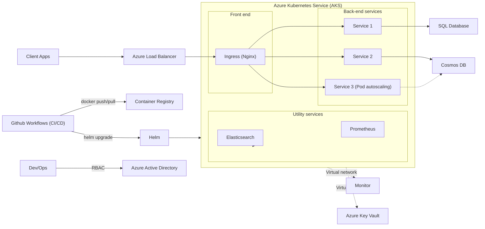
[Task: Develop Azure Terraform deployment scripts and GitHub workflows to automate resource provisioning](https://github.com/huangyingting/CopilotX/issues/1)

## Github Spark
GitHub Spark is an AI-powered tool for creating and sharing micro apps (“sparks”), which can be tailored to your exact needs and preferences, and are directly usable from your desktop and mobile devices. Without needing to write or deploy any code.

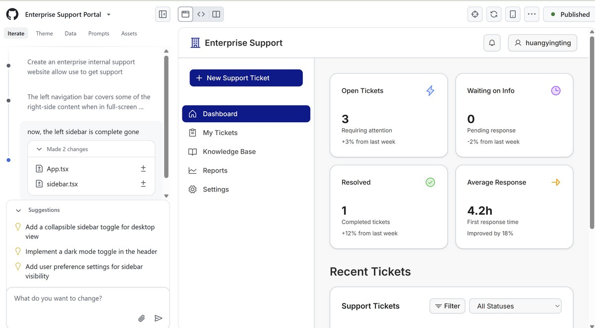

Spark Demo
[Use Spark to Create Enterprise Support Website](https://github.com/spark/huangyingting/enterprise-support-p)

Demo application
[Enterprise Support](https://enterprise-support-p--huangyingting.github.app/)

## Azure SRE Agent
Azure SRE Agent brings these principles to your Azure hosted applications by providing an AI-powered tool that helps sustain production cloud environments.
